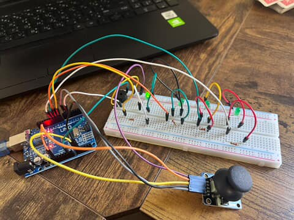

# JoyLock

This was my first ever arduino project, so please excuse the rough  code. As I grow in this field I plan to add more features and make this cleaner and more professional - **hopefully**.

## Items required

- Arduino (duhhh)
- A joystick
- 4 green LED's
- 4 resisters
- 1 Active buzzer
- Tons of cables

## Arduino Pin Mapping

- A0: VRX (Joystick)
- A1: VRY (Joystick)
- D6: SW (Joystick)
- D8–D11: LEDs 1–4
- D5: Active buzzer